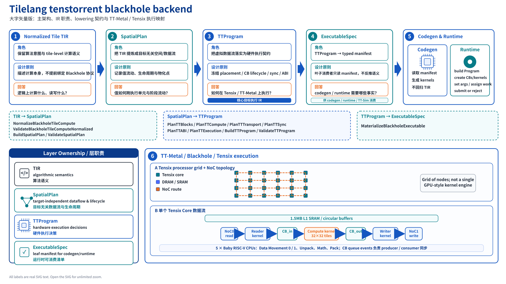
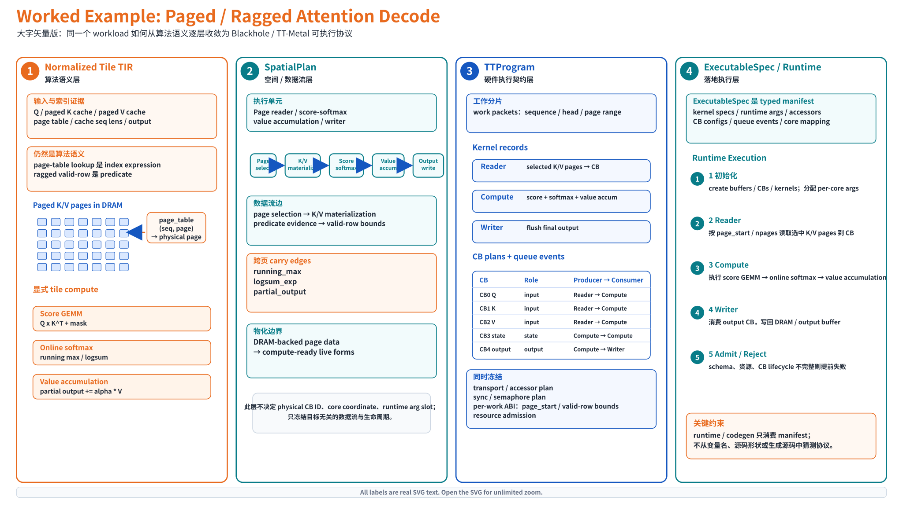

# TileLang Blackhole Backend Workspace

这是 TileLang Tenstorrent Blackhole 后端的主开发工作区。

当前工程目标不是维护一组 case-specific lowering，而是把 Blackhole
backend 收敛到稳定、显式、可验证的编译链路：

```text
Normalized Tile TIR
  -> SpatialPlan
  -> TTProgram
  -> ExecutableSpec
```

`TTProgram` 是当前 Blackhole target-facing execution contract。
Runtime 和 codegen 只消费 `ExecutableSpec` 的 leaf projection；它们不应该再从
source text、最终 TIR body、名字、参数位置、builtin 邻接关系或 runtime 观察中恢复语义。

## Architecture





## Current Status

当前状态只以 `tasks/progress.md` 为准。简要读法：

- Foundation `T1-T7.5` 已完成：buffer ABI、leaf compute/GEMM、sharding /
  materialization、exact-CB lifecycle 和已准入的非 workload runtime path
  都走 typed `TTProgram -> ExecutableSpec` contract。
- `P0` target execution contract hardening 已完成：CB queue events、
  exact-CB lifecycle、segment/kernel body、semaphore、remote core descriptors、
  launch association、runtime/per-work ABI、buffer/materialization/resource
  records 已收成 typed owner truth。
- `T8` irregular/indexed access 已完成：indexed、sparse、ragged、paged、
  segmented 和 grouped-feed paths 使用 generic `AccessRegion + value_expr`
  evidence。
- `P1 / T9` workload-first paths 正在推进：T9.1-T9.5 已在当前 bf16
  direct-runtime surface 上准入，当前 active boundary 是 T9.6 multi-block
  flash decode。
- `P2 / T10` distributed production variants 仍排队：mesh placement、CCL、
  NoC/multicast/global scheduling 和 production partial-K reducer protocol。

## Documentation Entrypoints

- Overall design:
  `tasks/dev_design/final_blackhole_backend_redesign.md`
- Current execution board:
  `tasks/progress.md`
- Design index:
  `tasks/dev_design/README.md`
- Architecture design overview for external explanation or image generation:
  `tasks/blackhole_architecture_design_overview.md`
- Root-cause design:
  `tasks/dev_design/task0_ir_layering_root_cause.md`
- Stable experience and bug memory:
  `memory/general_dev.md`
  / `memory/bugs.md`
- Working norms:
  `AGENTS.md`
  / `CLAUDE.md`
  / `GEMINI.md`

Do not use `tasks/dev_design/archive/` as current design input.  Archived
documents are historical reference only.

## Recommended Reading Order

1. `tasks/dev_design/final_blackhole_backend_redesign.md`
2. `tasks/dev_design/task0_ir_layering_root_cause.md`
3. `tasks/dev_design/task1_spatial_plan_companion.md`
4. `tasks/dev_design/task2_ttprogram_companion_cutover.md`
5. `tasks/dev_design/task3_runtime_gate_and_workload_cutover.md`
6. `tasks/progress.md`
7. `tasks/dev_design/README.md`
8. Current/supporting design docs listed in `tasks/dev_design/README.md`
9. `memory/general_dev.md`
10. `memory/bugs.md`
11. Relevant code and tests

## Repository Layout

- `tilelang_repo/`:
  TileLang development checkout.  Blackhole implementation lives mostly in
  `src/transform/`, `src/target/`, and `tilelang/engine/`.
- `tt_metal_repo/`:
  TT-Metal checkout.  TT-Metal API, runtime, simulator, and examples reference.
- `tasks/`:
  design contracts, execution board, project overview, and archived task
  history.
- `memory/`:
  durable engineering lessons and reusable bug records.
- `scripts/`:
  environment setup and helper scripts, including the TT-Sim setup entrypoint.

## Verification Baseline

Default development build directory:

```bash
cd tilelang_repo
cmake --build build -j32
```

For Blackhole direct runtime / TT-Sim validation, use the fixed repository
entrypoint in the same shell as the test command:

```bash
source /root/dev/vibe_dsl/scripts/setup_tt_sim.sh
export TILELANG_HOME=/root/dev/vibe_dsl/tilelang_repo
cd /root/dev/vibe_dsl/tilelang_repo
```

Runtime correctness gates use `BlackholeModule` and the repository TT-Sim bf16
baseline where tensor values are involved.  Legacy external runner paths are
not a current validation target.

## Documentation Rules

- Do not add a second overall design document.
- Keep current execution state only in `tasks/progress.md`.
- Keep design docs as contracts, not chronological notebooks.
- Keep architecture design summaries concise and point them back to the
  authoritative design files.
- Put durable lessons in `memory/`.
- If docs and code diverge, update the relevant design/status first, then
  continue implementation.
