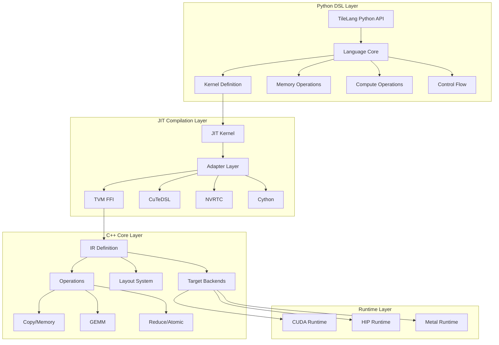
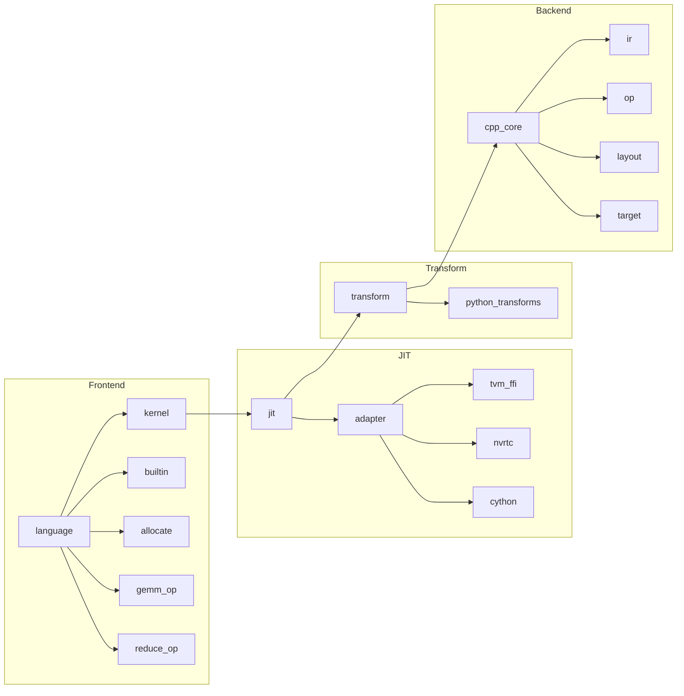
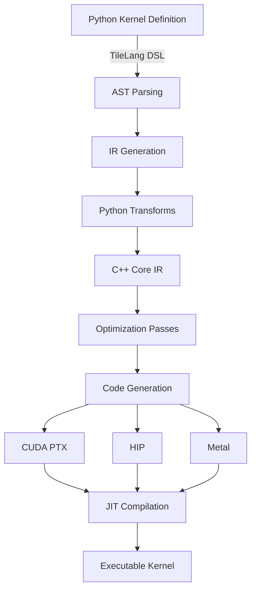

# TileLang 源代码分析

## 项目概览

TileLang 是一个用于开发高性能 GPU/CPU 内核的领域特定语言 (DSL)，基于 TVM 编译器基础设施构建。它通过 Pythonic 的语法让开发者能够编写接近硬件性能的内核代码，而无需直接编写 CUDA/ROCm 底层代码。

## 项目规模

- **Python 文件**: ~217 个
- **C++ 文件**: ~200 个 (cc + h)
- **示例文件**: ~258 个
- **仓库地址**: https://github.com/tile-ai/tilelang

## 支持的硬件后端

| 后端 | 状态 | 说明 |
|------|------|------|
| NVIDIA CUDA | ✅ 完全支持 | H100 (TMA/WGMMA), A100, V100, RTX 4090/3090/A6000 |
| AMD ROCm/HIP | ✅ 完全支持 | MI250 (MatrixCore), MI300X (Async Copy) |
| Apple Metal | ✅ 支持 | macOS GPU 加速 |
| WebGPU | ✅ 支持 | Web 端推理 |
| Huawei Ascend | ✅ 支持 | AscendC 和 Ascend NPU IR 后端 |

## 整体架构



## 核心特性

### 1. Pythonic DSL
- 使用 Python 语法定义内核
- 支持张量类型注解
- 丰富的内置操作（copy, gemm, reduce 等）
- 灵活的循环控制和并行化

### 2. 自动优化
- 自动向量化
- 内存访问优化
- L2 Cache Swizzling
- 软件流水线 (Software Pipelining)

### 3. 多后端支持
- 统一的 DSL，生成不同后端代码
- CUDA PTX 代码生成
- HIP 代码生成
- Metal Shading Language 生成

### 4. 高级功能
- 自动微分 (AutoDD)
- 自动调优 (AutoTuner)
- 性能分析 (Profiler)
- 量化支持 (Quantization)

## 模块依赖关系



## 编译流程概述



## 目录结构

```
tilelang/
├── tilelang/              # Python 包
│   ├── __init__.py        # 包入口
│   ├── language/          # DSL 语言核心
│   │   ├── kernel.py      # 内核定义
│   │   ├── builtin.py     # 内置操作
│   │   ├── allocate.py    # 内存分配
│   │   ├── gemm_op.py     # GEMM 操作
│   │   ├── reduce_op.py   # 归约操作
│   │   ├── copy_op.py     # 拷贝操作
│   │   └── ...
│   ├── jit/               # JIT 编译系统
│   │   ├── __init__.py
│   │   ├── kernel.py      # 内核编译
│   │   └── adapter/       # 适配器
│   ├── transform/         # Python 层变换
│   ├── autodd.py          # 自动微分
│   ├── autotuner/         # 自动调优
│   ├── profiler/          # 性能分析
│   └── ...
├── src/                   # C++ 核心源码
│   ├── ir.cc              # IR 定义
│   ├── op/                # 操作实现
│   │   ├── copy.cc        # 拷贝操作
│   │   ├── gemm.cc        # GEMM 操作
│   │   ├── reduce.cc      # 归约操作
│   │   └── ...
│   ├── layout/            # 布局系统
│   ├── target/            # 目标后端
│   ├── transform/         # C++ 变换
│   └── runtime/           # 运行时
├── examples/              # 示例代码
│   ├── gemm/              # GEMM 示例
│   ├── flash_attention/   # FlashAttention
│   ├── deepseek_mla/      # MLA Decoding
│   └── ...
├── benchmark/             # 基准测试
├── testing/               # 测试框架
└── 3rdparty/              # 第三方依赖
    ├── tvm/               # TVM 编译器
    └── cutlass/           # CUTLASS 库
```

## 关键文件说明

| 文件 | 说明 |
|------|------|
| `tilelang/__init__.py` | Python 包入口，导出公共 API |
| `tilelang/language/kernel.py` | 内核定义核心 |
| `tilelang/language/builtin.py` | 内置操作（47KB 核心文件）|
| `tilelang/jit/__init__.py` | JIT 编译入口 |
| `tilelang/jit/kernel.py` | 内核编译实现 |
| `src/ir.cc` | C++ IR 定义 |
| `src/op/copy.cc` | 拷贝操作实现（85KB 重要文件）|
| `src/op/gemm.cc` | GEMM 操作实现 |
| `CMakeLists.txt` | 构建配置 |
| `pyproject.toml` | Python 包配置 |

## 设计哲学

1. **简洁性**: 使用 Pythonic 语法，降低 GPU 编程门槛
2. **性能优先**: 生成的代码可达到手写 CUDA 的性能
3. **可移植性**: 同一套代码可编译到不同硬件后端
4. **可组合性**: 通过 DSL 原语组合实现复杂算子
5. **与 TVM 生态集成**: 复用 TVM 的编译基础设施

## 文档索引

- [项目架构详解](./01_architecture_overview.md)
- [编译流程详解](./02_compilation_pipeline.md)
- [Python 核心包分析](./python_core/)
- [JIT 编译系统分析](./jit/)
- [C++ 核心实现分析](./cpp_core/)
- [高级功能模块分析](./advanced/)
- [示例代码分析](./examples/)
- [测试框架](./testing.md)
- [基准测试](./benchmark.md)
